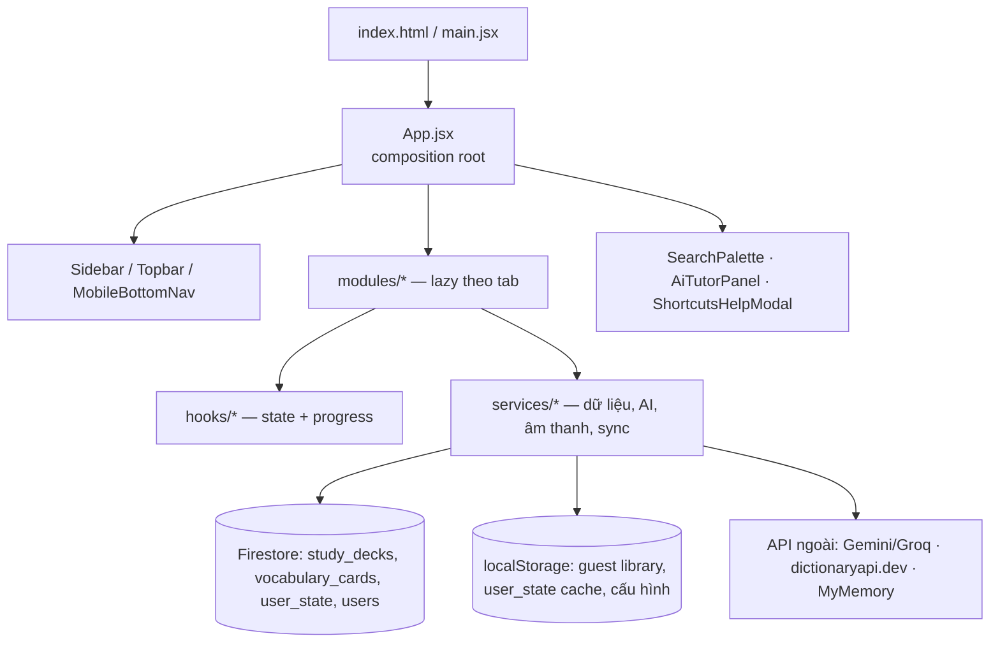

# Lingua — All-in-one Language Learning Hub

> **Đọc file này là đủ để hiểu dự án.** Tài liệu được viết cho AI/dev mới: kiến trúc, mọi file quan trọng, mô hình dữ liệu, quy ước, lệnh chạy và các "bẫy" đã từng gặp. Không cần đọc hết source để nắm dự án.
> Ngôn ngữ UI: **tiếng Việt**. Nội dung học: **tiếng Anh trình độ A1–C2 (trọng tâm B1)**.

## 0. TL;DR cho AI

- **Là gì**: PWA học tiếng Anh all-in-one — từ vựng SRS, ngữ pháp, 4 kỹ năng, luyện câu, thi thử B1, writing AI, planner, mindmap, tiến độ/gamification, gia sư AI.
- **Stack**: React 18 (StrictMode) + Vite + Tailwind 3 + Firebase (Auth + Firestore, offline cache) + react-router 7 + Capacitor (APK Android). Không backend riêng (trừ Cloud Function tuỳ chọn ở `functions/`).
- **Composition root**: `src/App.jsx` — giữ tab hiện tại, lazy-load module theo registry, đồng bộ dữ liệu khách → tài khoản, quản lý đăng nhập/streak/search/tutor.
- **"Nguồn sự thật" cần nhớ**: điều hướng `src/data/navigation.js` · dữ liệu `src/services/dataService.js` · lịch ôn `src/utils/srs.js` · state theo tài khoản `src/services/userDocService.js` (`user_state`) · design system `src/index.css`.
- **Chạy**: `npm install` → `npm run dev` (nếu thấy lỗi React lạ, chạy `npm run dev -- --force`) · build `npm run build` · test `npm test` (scripts trong `package.json`).
- **Không có test cho UI/component**; `npm test` chỉ test hàm thuần (SRS, gamification, chấm phát âm, từ điển).
- **Không tạo thêm hệ thống thông báo mới**: trước đây có tới 6 cách hiện thông báo chồng chéo, tất cả đã gom về `toast.*` trong `src/services/toast.js`.

---

## 1. Stack & phụ thuộc chính

| Nhóm | Dùng gì |
| --- | --- |
| UI | React, `react-router-dom` (routing theo path), Tailwind CSS, `lucide-react` (icon) |
| Hiệu ứng | `canvas-confetti` (chúc mừng), `react-player` (audio/video), `html-to-image` |
| Dữ liệu | Firebase Auth + Firestore (`initializeFirestore` + `persistentLocalCache` để dùng offline) |
| Nội dung nâng cao | `@xyflow/react` + `dagre` (mindmap), `jszip` (import Anki `.apkg`), `sql.js` (đọc DB Anki trong trình duyệt) |
| Di động | `@capacitor/core|app|browser`, `@codetrix-studio/capacitor-google-auth` (tuỳ chọn) |
| Build | Vite (`base` = `/lingua/` khi `GITHUB_PAGES=true`), PostCSS/Tailwind |

Node ≥ 20 (đã kiểm chứng với Node 24). Không có ESLint/TypeScript; chất lượng dựa vào convention + test hàm thuần.

## 2. Lệnh thường dùng

| Lệnh | Việc |
| --- | --- |
| `npm install` | Cài dependency |
| `npm run dev` | Dev server (thêm `-- --force` khi dependency cache lỗi thời) |
| `npm run build` | Build production ra `dist/` (dùng để **kiểm tra sau mỗi lần sửa**) |
| `npm run preview` | Xem thử bản build |
| `npm test` | `node --test "tests/*.test.js"` — 4 file test, 26 test |

## 3. Kiến trúc & luồng



**Cách App.jsx hoạt động**

1. `navigationItems` (`src/data/navigation.js`) khai báo tab: `id, label, shortLabel, description, icon`.
2. `modules` map tab → component lazy; `tabPaths` map tab → URL (`/vocabulary`, `/grammar`, …); path không hợp lệ bị điều hướng về `/vocabulary`.
3. Mỗi module nhận props chung: `onStudyActivity` (ghi streak + lịch sử), `streak`, `user`, `apiKey`, `setApiKey`, `onGoogleLogin`, `onSignOut`.
4. Tab `settings` render thêm các panel: `AccountPanel` → `AppearancePanel` → `InstallAppPanel` → `AccountDataPanel` → `ApiSettings`.
5. `onAuthStateChanged` → nạp streak + API key (ưu tiên key của tài khoản) + `syncGuestData()` (đẩy dữ liệu khách lên cloud, tăng `dataVersion` để remount module).

**Thêm một tab mới (đúng 4 bước)**: tạo `src/modules/<domain>/<Name>Hub.jsx` → thêm item vào `src/data/navigation.js` → thêm `lazy()` + entry trong `modules`/`tabPaths` ở `App.jsx` → (tuỳ chọn) thêm icon vào `iconById` của `src/components/MobileBottomNav.jsx`.

## 4. Cây thư mục

```text
src/
├─ App.jsx                 # composition root: tab, auth, streak, search, tutor, shortcuts
├─ main.jsx                # createRoot + StrictMode + bootstrapAppearance()
├─ index.css               # design system (.panel/.btn-*/...), dark mode, print styles
├─ components/             # UI dùng chung
│  ├─ layout/              # Sidebar, Topbar
│  ├─ learning/            # FlashcardModal, QuizView, SpellerView, MatchingView, StudyHubModal, StudySummary, ImportExportModal
│  ├─ ui/                  # CollapsibleCard, ProgressBar, SafeImage, StatCard, StudyHistoryChart, SyncStatusBadge, Toaster
│  ├─ Auth/AuthPage.jsx    # đăng nhập/đăng ký (Email + Google) và chế độ khách
│  ├─ AiTutorPanel.jsx     # chat gia sư AI
│  ├─ SearchPalette.jsx    # tìm kiếm toàn cục (Ctrl/⌘+K)
│  ├─ ShortcutsHelpModal.jsx, AccountPanel, AccountDataPanel, GoogleSignInHelp, AppMark, WordAvatar, StudyAnalyticsWidget, MobileHeader, MobileBottomNav
├─ modules/                # 1 folder = 1 tab
│  ├─ learning/VocabularyHub.jsx        # tab Từ vựng (file lớn nhất, ~1.4k dòng)
│  ├─ learning/GrammarAndVocabulary.jsx # WritingChecker (tab Writing)
│  ├─ grammar/                          # GrammarHub, GrammarLesson, GrammarQuiz (QuestionSet dùng lại cho nghe/đọc/thi thử)
│  ├─ skills/                           # SkillsHub + ListeningView, ReadingView, SpeakingView, WritingView, SentenceView, MockTestView
│  ├─ progress/ProgressHub.jsx          # mục tiêu, XP, huy hiệu, thống kê gộp, xuất báo cáo
│  ├─ planner/StudyPlanner.jsx          # todo + lịch + pomodoro
│  ├─ mindmap/StudyMindmap.jsx          # sơ đồ cây React Flow (+ sinh bằng AI)
│  └─ settings/                         # ApiSettings, AppearancePanel, InstallAppPanel
├─ hooks/                  # useCloudDoc, useDailyGoal, useGrammarProgress, useSkillsProgress, useStudyReminder, useSectionState, useTheme, useAppearance, useInstallPrompt, useDebounce
├─ services/               # xem bảng §7
├─ utils/                  # srs, speech, speechScore, ankiParser, sanitizeCard, studyFeedback
├─ data/                   # navigation + toàn bộ nội dung học (tĩnh, không cần mạng)
├─ config/googleAuth.js    # chế độ đăng nhập Google
└─ lib/formatters.js       # format ngày/giờ tiếng Việt
```

Thư mục gốc: `index.html` (đăng ký service worker), `public/` (`manifest.json`, `sw.js`, `oauth-callback.html`, `icons/`), `firestore.rules`, `firebase.json`, `capacitor.config.json`, `functions/` (Cloud Function proxy AI — **không** được Vite build), `tests/`, `.github/workflows/` (deploy + build APK).

**File chết (đã bị thay thế, xoá được)**: `src/modules/{grammar/GrammarModule,mindmap/MindmapModule,planner/PlannerModule,settings/SettingsModule,vocabulary/VocabularyModule}.jsx`.

## 5. Điều hướng & các tab

| Tab id | URL | Module | Nội dung chính |
| --- | --- | --- | --- |
| `vocabulary` | `/vocabulary` | `VocabularyHub` | Bộ thẻ, SRS, 4 chế độ học, thùng rác, sửa hàng loạt, thêm từ (AI/từ điển miễn phí), import/export |
| `grammar` | `/grammar` | `GrammarHub` | 12 thì + 8 cấu trúc B1, cheat sheet, kiểm tra cuối bài (đạt ≥ 80%) |
| `skills` | `/skills` | `SkillsHub` | 6 sub-tab: Nghe, Đọc, Nói (chấm phát âm), Viết, Luyện câu, Thi thử B1 |
| `writing` | `/writing` | `WritingChecker` | Chấm chữa bài viết bằng AI |
| `progress` | `/progress` | `ProgressHub` | Mục tiêu ngày, XP/cấp, huy hiệu, 12 ô thống kê, biểu đồ, in báo cáo |
| `planner` | `/planner` | `StudyPlanner` | Todo, lịch học, pomodoro |
| `mindmap` | `/mindmap` | `StudyMindmap` | Sơ đồ tư duy (React Flow), sinh nhánh bằng AI, xuất ảnh |
| `settings` | `/settings` | `ApiSettings` + các panel | Tài khoản, giao diện, cài app, dữ liệu (backup/nhắc học/sync), API key |

Ngoài tab: `/login` (AuthPage cho khách), `/` → `/vocabulary`, path lạ → `/vocabulary`.

## 6. Mô hình dữ liệu

### 6.1 Thẻ từ vựng (`vocabulary_cards` / localStorage)

| Field | Ý nghĩa |
| --- | --- |
| `id`, `deckId`, `word`, `ipa`, `meaning`, `example` | Nội dung thẻ (`meaning` là tiếng Việt) |
| `level` | `A1…C2` (mặc định `B1`) |
| `status` | `new` \| `learning` \| `mastered` |
| `interval`, `nextReviewDate`, `reviewDate`, `repetition`, `lastStudiedDate` | SRS |
| `ease`, `lapses` | Hệ số giãn cách (mặc định 2.5) và số lần quên — nền tảng của "từ hay quên" |
| `imageUrl`, `audioUrl`, `needAiImage` | Ảnh/âm thanh (`imageUrl` **luôn** là `""`, không phải `undefined`) |
| `deletedAt` | Xoá mềm: có giá trị ⇒ nằm trong thùng rác |

Bộ thẻ (`study_decks`): `id, title, tags[], createdAt, deletedAt`.

### 6.2 Lịch ôn SRS (`src/utils/srs.js` — dùng chung, không hardcode nơi khác)

- `scheduleReview(card, rating)`: `again` → 1 ngày, reset `repetition`, `ease −0.2`, `lapses +1`; `soon` → thẻ mới 3 ngày, thẻ cũ `interval × ease × 0.9`; `mastered` → thẻ mới 5 ngày, thẻ cũ `interval × ease × 1.3`.
- Chặn: `ease ∈ [1.3, 3.2]`, `interval ≤ 365`. `lapses ≥ 4` ⇒ **leech (từ hay quên)**.
- `schedulePayload()` = bản đã bỏ cờ `leech` để ghi vào dữ liệu; `previewIntervals()` / `intervalLabel()` dùng để hiện khoảng nghỉ trên nút đánh giá; `isDue()` lọc "cần ôn hôm nay".

### 6.3 State theo tài khoản — collection `user_state`

Doc id `<uid>__<key>`, payload `{ userId, key, payload, updatedAt }`; có bản sao localStorage `lingua-user-state-<owner>__<key>` để dùng offline. Truy cập qua `useCloudDoc(key, …)` hoặc `createDebouncedSync(key)`.

| Key (`userDocKeys`) | Payload |
| --- | --- |
| `planner` | Todo + lịch học |
| `mindmap` | Node/edge của sơ đồ |
| `grammar` | `{ completed: { [lessonId]: { best, total, passed } }, lastLesson }` |
| `writing` | Bản nháp/bài đã chấm |
| `skills` | `{ listening: {id:{best,total}}, reading: {…}, mock: [{score,total,at}] (≤20), sentence: {attempted, correct} }` |
| `reminder` | `{ enabled, time }` |
| `history` | `{ days: { "YYYY-MM-DD": { reviewed, correct, sessions } } }` (≤ 400 ngày) |
| `goal` | `{ target }` — mục tiêu lượt ôn mỗi ngày (mặc định 20) |

### 6.4 Firestore & rules

Collection: `study_decks`, `vocabulary_cards`, `user_state`, `users/{uid}` (streak). `firestore.rules` chỉ cho chủ sở hữu đọc/ghi (`userId == request.auth.uid`, doc `user_state` có tiền tố uid). Dữ liệu khách **chỉ** nằm trên thiết bị, được đẩy lên khi đăng nhập (`syncVocabulary`, `syncGuestUserDocs`).

### 6.5 localStorage (các key quan trọng)

| Key | Nội dung |
| --- | --- |
| `lingua-vocabulary-library` | `{ decks, cards }` của khách (`lingua-vocabulary` là bản cũ, tự migrate) |
| `lingua-user-state-<owner>__<key>` | Cache `user_state` (`owner` = uid hoặc `guest`) |
| `lingua-appearance` | Bảng màu, font, cỡ chữ |
| `lingua-settings-sections` | Trạng thái mở/đóng các khối Cài đặt |
| `lingua-ai-provider` | `gemini` \| `groq` |
| `lingua_api_key_<uid>` / `lingua_api_key_guest` | API key AI (key khách tự chuyển cho tài khoản khi đăng nhập) |
| `lingua-tutor-chat-<uid|guest>` | 40 tin nhắn gần nhất của gia sư AI |
| `lingua-practice-topic`, `lingua-google-login-mode`, `lingua-google-auth-log` | Điều hướng nhanh vào phiên học; chế độ đăng nhập Google; log chẩn đoán |

## 7. Services (`src/services/`)

| File | Trách nhiệm |
| --- | --- |
| `dataService.js` | **Lớp dữ liệu duy nhất** cho deck/thẻ: khách = localStorage, đăng nhập = Firestore. Có `addCards` (batch 400), `updateCards` (sửa hàng loạt), `trash*/restore*/getTrashed/purgeTrash` (xoá mềm), `deleteDeck/deleteCard` (xoá cứng, dùng nội bộ). Luôn lọc `undefined` trước khi ghi Firestore |
| `userDocService.js` | State theo tài khoản (`user_state`), `syncGuestUserDocs`, `createDebouncedSync` |
| `historyService.js` | Lịch sử học theo ngày + event `lingua:history-changed` |
| `streakService.js` | Chuỗi ngày học (`users/{uid}` hoặc localStorage cho khách) |
| `aiService.js` | `requestAi(provider, apiKey, prompt, {json})` — Gemini (fallback 3 model) & Groq; hỗ trợ proxy qua `VITE_AI_PROXY_URL`; các prompt mẫu (`generateSmartVocabularyPrompt`, …) |
| `dictionaryService.js` | Tra từ **miễn phí** (dictionaryapi.dev + MyMemory), không cần key |
| `searchIndex.js` | Index tìm kiếm toàn cục (nav, ngữ pháp, kỹ năng, theme deck, 1000 từ thông dụng nạp lười) |
| `deepLink.js` | Mở đúng bài sau khi tìm kiếm (`openItem` / `consumePendingItem(tab)`) |
| `gamification.js` | `computeStats`, `computeXp`, `levelFor`, `achievementsFor` (hàm thuần, có test) |
| `syncStatus.js` | Online/offline, đếm write đang chờ, event `lingua:data-refresh` |
| `toast.js` | **Hệ thống thông báo duy nhất** (`toast.success/error/info/undo`) |
| `imageService.js` | Tìm ảnh an toàn cho thẻ (`findVocabularyImageSafely`), whitelist nguồn ảnh |
| `speech.js` (utils) | TTS tiếng Anh bằng Web Speech API |
| `firebase.js` | Khởi tạo app/auth/firestore (có offline cache) + re-export API Firebase |
| `authService.js`, `googleBrowserAuth.js`, `googleAuthConfig.js` | Đăng nhập Google: popup (web), browser flow + deep link (APK), paste id_token dự phòng |
| `backupService.js` | Xuất/nhập toàn bộ dữ liệu (file JSON) |
| `shareDeck.js` | Chia sẻ bộ thẻ qua URL `#deck=<base64url>` |
| `reminderService.js` | Nhắc học bằng Notification (chỉ khi app đang mở) |
| `appearanceService.js` | Bảng màu/font/cỡ chữ, đổi CSS variables |
| `vocabularySync.js` | Merge dữ liệu khách → tài khoản sau khi đăng nhập |
| `platform.js`, `apiClient.js`, `aiClient.js`, `apiKeyStorage.js` | Tiện ích nền tảng, client dự phòng, đọc/ghi API key |

## 8. Hooks (`src/hooks/`)

| Hook | Việc |
| --- | --- |
| `useCloudDoc(key, opts)` | Hydrate + debounce-save một `user_state` doc, tự reload theo `lingua:data-refresh` |
| `useDailyGoal()` | Mục tiêu ôn/ngày (key `goal`), `GOAL_PRESETS`, `setGoal` |
| `useGrammarProgress()` / `useSkillsProgress()` | Tiến độ ngữ pháp / kỹ năng (record + đọc) |
| `useStudyReminder(streak)` | Cấu hình nhắc học |
| `useSectionState(id, default)` | Trạng thái mở/đóng khối UI (localStorage) |
| `useTheme()`, `useAppearance()` | Dark mode + tuỳ biến giao diện |
| `useInstallPrompt()` | Nút "Cài app" (A2HS), nhận biết iOS |
| `useDebounce(value)` | Debounce tìm kiếm/nhập liệu |

## 9. Dữ liệu tĩnh (`src/data/`) — sửa nội dung học ở đây

| File | Nội dung |
| --- | --- |
| `commonWords.js` + `commonWords/part1-4.js` | 1.000 từ thông dụng (dòng `word\|meaning`), được **lazy import** để không phình bundle chính |
| `grammarCurriculum.js` | 12 thì × 8 câu hỏi + cheat sheet (`PASS_RATIO = 0.8`) |
| `grammarTopics.js`, `grammarIndex.js` | 8 cấu trúc B1; gộp thành `grammarAllItems` (20 bài) + `grammarSections` |
| `skills/listening.js` | 6 bài nghe (transcript từng câu, câu hỏi) |
| `skills/reading.js` | 6 bài đọc + glossary + câu hỏi |
| `skills/speaking.js` | 6 chủ đề (warm-up, cue card + bài mẫu, discussion, phrases) |
| `skills/writing.js` | 6 đề viết (email/đoạn văn) + checklist |
| `skills/sentencePractice.js` | 45 bài: 15 điền khuyết (cl), 15 sắp xếp (or), 15 viết lại (rw) |
| `themeDecks.js` | 7 bộ cụm từ theo chủ đề (`createThemeDeck(id)`) |
| `starterDeck.js` | Bộ "IELTS Speaking Part 1" 10 từ (bộ mẫu cũ, tự thay bằng bộ 1000 từ) |
| `navigation.js` | Danh sách tab |

## 10. Quy ước UI & design system

- Class dùng chung trong `src/index.css`: `.panel`, `.panel-flat`, `.eyebrow`, `.btn-primary`, `.btn-secondary`, `.btn-ghost`, `.icon-btn`, `.chip`, `.menu-item`, `.field`, `.metric` — **dùng lại, đừng viết lại**.
- Token Tailwind (`tailwind.config.js`): `ink`, `mist`, `sage`, `lime`, `slab`, `slab2`, `dark1-3`, `ok/warn/danger`. `lime`/`sage` trỏ vào CSS variable `--accent`/`--accent-2` (đổi theme = ghi 2 biến này).
- Dark mode bằng class `dark` trên `<html>`; `useTheme` đồng bộ `<meta name="theme-color">` để tránh nháy trắng.
- **Vùng chạm tối thiểu 44px**, chữ phụ tối thiểu `text-xs`, có `aria-label`/`aria-pressed`/`role` cho phần tử tương tác.
- Mọi thông báo dùng `toast.*`; xoá mềm thì kèm `toast.undo`.
- In báo cáo: `.no-print` (ẩn khi in) và `.print-report` (khung in) + `window.print()`.
- Nội dung dài nhiều dòng: dùng `whitespace-pre-wrap`; JSX dài một dòng là phong cách hiện có ở một số panel (giữ nguyên khi sửa nhỏ).

## 11. Tính năng theo module (hành vi cụ thể)

- **Từ vựng (`VocabularyHub`)**: phiên học tối đa `SESSION_LIMIT = 50` thẻ, danh sách hiện `RENDER_LIMIT = 60` rồi "Xem thêm". Bộ lọc: tất cả/chưa thuộc/đã thuộc + menu SRS (cần ôn hôm nay, interval 1/3/5, **từ hay quên**). 4 chế độ: flashcard 3D, trắc nghiệm, chính tả (TTS), nối từ. Tự tra ảnh khi thư viện ≤ 200 thẻ (tối đa 8 ảnh/lần tải).
- **FlashcardModal**: lật thẻ 3D, phím `Space` để lật, `1/2/3` để đánh giá, `←/Z` về thẻ trước; thẻ "chưa nhớ" quay lại cuối hàng đợi; nút đánh giá hiện khoảng nghỉ thật.
- **Ngữ pháp**: 20 bài, mỗi bài có cấu trúc/dấu hiệu/ví dụ/lỗi thường gặp; kiểm tra cuối bài đạt ≥ 80% mới tính hoàn thành và cộng chuỗi ngày.
- **Kỹ năng**: Nghe (TTS 0.8x/1x/1.2x + chép chính tả), Đọc (glossary + câu hỏi), Nói (ghi âm + **chấm điểm phát âm** bằng Web Speech API: % khớp, từ chưa rõ, tốc độ nói), Viết, Luyện câu (3 dạng), Thi thử B1 (28 câu: 12 ngữ pháp + 8 từ vựng + 4 đọc + 4 nghe, 30 phút, ước lượng band).
- **Tiến độ**: XP = lượt ôn ×2 + đúng ×3 + phiên ×8 + thẻ đã thuộc ×2 + bài ngữ pháp ×30 + bài nghe/đọc ×15 + câu đúng ×1 + thi thử ×60; 11 cấp (`LEVEL_STEPS`); 16 huy hiệu. `ProgressHub` đọc toàn bộ thẻ của người dùng (như `VocabularyHub`).
- **Gia sư AI**: chat có prompt hệ thống (trả lời tiếng Việt, ví dụ tiếng Anh kèm nghĩa, tối đa 200 từ), gửi 6 tin nhắn gần nhất làm ngữ cảnh, lưu hội thoại cục bộ.
- **Chia sẻ/sao lưu**: `shareDeck` tạo link `#deck=…` (khách mở link thấy hộp thoại nhập bộ); `backupService` xuất/nhập JSON toàn bộ dữ liệu.
- **Tìm kiếm toàn cục**: `Ctrl/⌘+K` → tìm theo `searchIndex` (bỏ dấu tiếng Việt) → chọn kết quả thì `openItem()` điều hướng + ghi "mục đang chờ"; module đích gọi `consumePendingItem('<tab>')` khi mount (vì module lazy nên có thể mount sau sự kiện).

## 12. AI: provider, key, proxy

- Provider: `gemini` (thử lần lượt `gemini-3.6-flash` → `gemini-2.0-flash` → `gemini-1.5-flash`) hoặc `groq` (`llama-3.3-70b-versatile`). Chọn ở Cài đặt → API (localStorage `lingua-ai-provider`).
- Không có key: **tra từ vẫn dùng được** (từ điển miễn phí); các tính năng khác báo lỗi thân thiện và nhắc mở Cài đặt.
- Proxy tuỳ chọn (người dùng không cần key): deploy `functions/index.js` (Cloud Function v2, rate-limit theo IP) rồi build với `VITE_AI_PROXY_URL=https://<region>-<project>.cloudfunctions.net/aiProxy npm run build`. Khi có biến này, `requestAi` gọi proxy và bỏ qua key client.
- Prompt trả JSON (Gemini `responseMimeType`, Groq `response_format`) và parse bằng `parseAiJson` — luôn bọc `try/catch` và hiển thị lỗi qua `toast`.

## 13. Biến môi trường & cấu hình

| Biến / file | Ý nghĩa |
| --- | --- |
| `GITHUB_PAGES` | Build cho GitHub Pages → `base = /lingua/` |
| `VITE_AI_PROXY_URL` | Bật proxy AI (không cần API key client) |
| `VITE_GOOGLE_USE_NATIVE_AUTH=1` | Dùng plugin Google Auth native cho APK (mặc định tắt) |
| `src/config/googleAuth.js` | Hằng số `GOOGLE_LOGIN_MODE`, override theo thiết bị qua localStorage `lingua-google-login-mode` (Cài đặt → Tài khoản) |
| `public/sw.js`, `index.html` | Service worker: chỉ đăng ký ngoài `localhost`/`.local` và khi không chạy trong Capacitor; ở localhost sẽ **unregister + xoá cache** |
| `capacitor.config.json`, `.github/workflows/build-apk.yml` | Đóng gói APK; workflow tự vá `AndroidManifest.xml` thêm deep link `com.lingua.studyhub://auth` |

## 14. Test

- `tests/srs.test.js` — lịch ôn, leech, clamp, đến hạn.
- `tests/gamification.test.js` — stats, XP, cấp, huy hiệu.
- `tests/speechScore.test.js` — so khớp câu, điểm, tốc độ nói.
- `tests/dictionaryService.test.js` — tra từ miễn phí với `fetch` được mock.
- Viết test mới: tạo `tests/<ten>.test.js` dùng `node:test` + `node:assert/strict`, **import kèm đuôi `.js`** (Node ESM yêu cầu), và chỉ test module không phụ thuộc DOM/Firebase. `npm test` chạy `node --test "tests/*.test.js"`. Muốn test module mới thì module đó (và các import của nó) phải dùng đuôi `.js` hoặc không import gì.

## 15. Deploy

- Repo: `https://github.com/trannhatthien539-wq/lingua` (branch `main`). Push lên `main` → `.github/workflows/deploy.yml` deploy GitHub Pages (`base=/lingua/`) và `build-apk.yml` build artifact APK.
- Web: `https://trannhatthien539-wq.github.io/lingua/` (~30 giây/lần deploy; `dist/` bị gitignore, build trong CI).
- Mọi thay đổi nên chạy `npm run build` (và `npm test` nếu sửa logic thuần) trước khi push.

## 16. Bẫy đã từng gặp (đọc trước khi sửa)

1. **StrictMode bật** (`main.jsx`): effect chạy 2 lần → không sinh id bằng `Date.now()` đơn thuần (dùng `makeId(prefix)`), và seeding phải single-flight (`starterSeedPromise`).
2. **Firestore từ chối `undefined`**: mọi payload ghi phải qua `omitUndefined`; `imageUrl` mặc định `""`.
3. **Service worker cũ gây "Invalid hook call / multiple React copies"** khi dev: chạy `npm run dev -- --force` và xoá cache/SW nếu thấy lỗi lạ.
4. **Thẻ lật 3D**: không được đổi `index` cùng lúc với `setFlipped(false)` — mặt sau của thẻ mới sẽ lộ ra khi xoay; phải đổi nội dung sau khi thẻ xoay xong (`advanceAfterFlip`, `FLIP_MS` khớp `duration-500`).
5. **Module lazy + sự kiện**: không dispatch sự kiện rồi hy vọng module chưa mount nhận được — dùng cơ chế "pending item" trong `deepLink.js`.
6. **React Flow**: `nodeTypes`/`defaultEdgeOptions` phải là hằng ngoài component; ẩn handle thì phải `pointer-events-none`.
7. **Tailwind + font scale**: cỡ chữ đổi `html{font-size}` nên tránh phần tử có min-width theo `rem` trong hàng ngang (từng gây tràn ở planner).
8. **Bottom nav mobile**: 8 tab nên phải cuộn ngang (`min-w-[62px]`), không dùng `justify-around`.
9. **In báo cáo**: nhớ class `.no-print` cho chrome (Sidebar/Topbar/MobileHeader/BottomNav đã gắn sẵn).
10. **`node --test tests` (thư mục trần) không chạy được** — phải dùng glob `"tests/*.test.js"`.

## 17. Chưa làm (roadmap)

- Tài khoản: quên mật khẩu, xác thực email, xoá tài khoản, đăng nhập Facebook/Apple.
- Xã hội: thư viện bộ từ cộng đồng, xếp hạng bạn bè, chế độ lớp học/giáo viên (cần backend + rules mới).
- Push notification khi app đóng (FCM), thông báo theo lịch của hệ điều hành.
- Đa ngôn ngữ giao diện (i18n) và học ngôn ngữ khác ngoài tiếng Anh.
- Sửa hàng loạt nâng cao (gắn tag, đổi bộ), tìm ảnh thủ công cho thư viện lớn.

## 18. Checklist khi thêm tính năng

1. Xác định tab/module liên quan; nếu là tab mới → làm đủ 4 bước ở §3.
2. Dữ liệu mới: ưu tiên thêm field vào card/deck hoặc một key `user_state` mới (đặt tên trong `userDocKeys`) thay vì tạo collection mới (nhớ cập nhật `firestore.rules` và bổ sung key vào danh sách `syncGuestUserDocs` ở `App.jsx`).
3. Ghi/đọc dữ liệu **chỉ** qua `dataService`/`userDocService` — không gọi Firestore trực tiếp từ component.
4. Trạng thái UI dùng hook có sẵn (`useSectionState`, `useDebounce`, `useDailyGoal`…).
5. Thông báo qua `toast`; thao tác xoá phải là xoá mềm + `toast.undo`.
6. Thêm nội dung học thì đặt trong `src/data/…` và (nếu cần tìm kiếm) bổ sung vào `searchIndex.js`.
7. Cập nhật icon bottom nav nếu là tab mới; thêm mục vào `SearchPalette`/`ShortcutsHelpModal` nếu có phím tắt hoặc lệnh mới.
8. Chạy `npm test` (nếu sửa logic thuần) và `npm run build`; smoke-test nhanh trên `npm run dev`.
